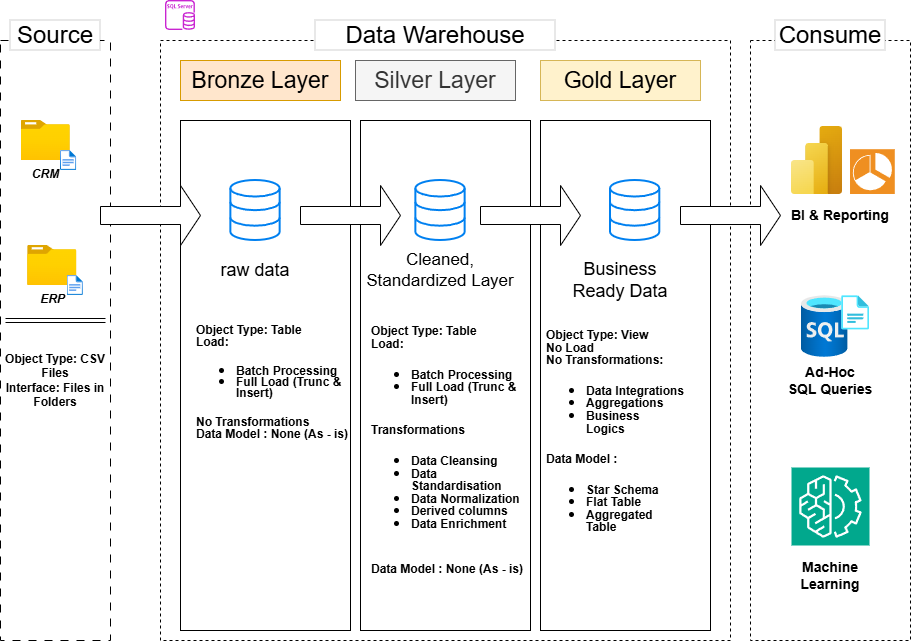

# SQL Data Warehouse Project

A SQL Server data warehouse built end-to-end following the **Medallion Architecture** (Bronze → Silver → Gold). Raw CSV exports from a CRM and an ERP system are ingested, cleaned/standardized, and modeled into a star schema that's ready for reporting, ad-hoc SQL analysis, and machine learning.



---

## 🏗️ Architecture

The warehouse is organized into three layers, each implemented as its own SQL schema (`bronze`, `silver`, `gold`):

| Layer | Object Type | Load Pattern | Transformations | Data Model |
|---|---|---|---|---|
| **Bronze** | Tables | Batch, full load (truncate & insert) | None (as-is) | None (as-is) |
| **Silver** | Tables | Batch, full load (truncate & insert) | Data cleansing, standardization, normalization, derived columns, enrichment | None (as-is) |
| **Gold** | Views (no load) | — | Data integration, aggregation, business logic | Star schema, flat tables |

- **Source:** CSV files from **CRM** and **ERP** systems, dropped into folders and bulk-inserted.
- **Consume:** the Gold layer views are queried directly for **BI & Reporting**, **ad-hoc SQL queries**, and **Machine Learning**.

More diagrams are available in [`docs/`](docs):
- `Data Architecture Diagram.drawio` – the high-level Bronze/Silver/Gold flow shown above
- `Data_Flow_Diagram.drawio` – how each source file moves through the layers
- `Data_Flow_Lineage.drawio` – column-level lineage
- `Sales_Data_Mart_Star_Schema.drawio` – the Gold layer star schema (ER diagram)
- `data_catalog.md` – full column-by-column data dictionary for the Gold layer

---

## 📁 Repository Structure

SQL-Project/
│
├── Datasets/ # Raw source data (as provided by CRM/ERP)
│ ├── source_crm/
│ │ ├── cust_info.csv
│ │ ├── prd_info.csv
│ │ └── sales_details.csv
│ └── source_erp/
│ ├── CUST_AZ12.csv
│ ├── LOC_A101.csv
│ └── PX_CAT_G1V2.csv
│
├── scripts/
│ ├── database_creation.sql # Creates the DataWarehouse DB + bronze/silver/gold schemas
│ ├── Bronze Layer/
│ │ ├── DDL.sql # CREATE TABLE statements for bronze.*
│ │ └── Data_Loading.sql # bronze.load_data stored procedure (BULK INSERT from CSV)
│ ├── Silver Layer/
│ │ ├── DDL.sql # CREATE TABLE statements for silver.*
│ │ └── Data_Loading.sql # Cleansing/standardization load procedure
│ └── Gold Layer/
│ └── DDL.sql # CREATE VIEW statements for gold.dim_customers,
│ # gold.dim_products, gold.fact_sales
│
├── Tests/
│ ├── Silver_Layer.sql # Data quality checks (nulls, dupes, spacing, date logic)
│ └── Gold_Layer.sql # Surrogate key uniqueness + fact/dimension connectivity
│
├── EDA/ # Exploratory data analysis & reporting views on the Gold layer
│ ├── 01_Database_Exploration.sql
│ ├── 02_Dimension_Exploration.sql
│ ├── 03_Date_Range_Exploration.sql
│ ├── 04_Measures_Exploration.sql
│ ├── 05_Magnitude Analysis.sql
│ ├── 06_Ranking Analysis.sql
│ ├── 07_Change Over Time Analysis.sql
│ ├── 08_Cumulative Analysis.sql
│ ├── 09_Performance_Analysis.sql
│ ├── 10_Data_Segmentation_Analysis.sql
│ ├── 11_Part_to_Whole_Analysis.sql
│ ├── 12_Customer_Report.sql # Builds the gold.report_customers view
│ └── 13_Product_Report.sql # Builds the gold.report_products view
│
├── docs/
│ ├── Data Architecture Diagram.drawio
│ ├── Data_Flow_Diagram.drawio
│ ├── Data_Flow_Lineage.drawio
│ ├── Sales_Data_Mart_Star_Schema.drawio
│ ├── Data_Architecture_Diagram.png
│ └── data_catalog.md
│
└── Readme.md


---

## 🗃️ Data Model (Gold Layer)

The Gold layer exposes a classic star schema:

- **`gold.dim_customers`** — surrogate `customer_key`, enriched with demographic (`gender`, `birthdate`, `marital_status`) and geographic (`country`) attributes, merged from CRM + ERP customer sources.
- **`gold.dim_products`** — surrogate `product_key`, with category/subcategory, cost, product line, and maintenance flag; filtered to current (non-historical) products only.
- **`gold.fact_sales`** — one row per sales order line, linked to `dim_customers` and `dim_products` via their surrogate keys, with `order_date`, `shipping_date`, `due_date`, `sales_amount`, `quantity`, and `price`.

Full column definitions, data types, and descriptions are documented in [`docs/data_catalog.md`](docs/data_catalog.md).

---

## 🚀 Getting Started

Requirements: **SQL Server** (with `BULK INSERT` access to the `Datasets` folder) and **SQL Server Management Studio** (or another SQL Server client).

1. **Create the database and schemas**
```sql
   -- Run scripts/database_creation.sql
```
2. **Build the Bronze layer**
```sql
   -- Run scripts/Bronze Layer/DDL.sql
   -- Run scripts/Bronze Layer/Data_Loading.sql to create bronze.load_data
   EXEC bronze.load_data;
```
   > Update the file paths in `Data_Loading.sql`'s `BULK INSERT` statements to point at your local copy of `Datasets/source_crm` and `Datasets/source_erp`.
3. **Build the Silver layer**
```sql
   -- Run scripts/Silver Layer/DDL.sql
   -- Run scripts/Silver Layer/Data_Loading.sql to load and standardize the data
```
4. **Build the Gold layer**
```sql
   -- Run scripts/Gold Layer/DDL.sql
   -- This creates gold.dim_customers, gold.dim_products, and gold.fact_sales as views
```
5. **Validate**
```sql
   -- Run Tests/Silver_Layer.sql after loading Silver
   -- Run Tests/Gold_Layer.sql after creating Gold views
```

---

## ✅ Data Quality Checks

- **`Tests/Silver_Layer.sql`** checks for null/duplicate primary keys, unwanted whitespace, inconsistent categorical values, and invalid date ranges (e.g. `prd_start_dt > prd_end_dt`) across the CRM and ERP tables.
- **`Tests/Gold_Layer.sql`** checks for duplicate surrogate keys in `dim_customers` and `dim_products`, and verifies referential integrity between `fact_sales` and its dimensions.

---

## 📊 EDA & Analytics

The [`EDA/`](EDA) folder holds a progressive set of exploratory SQL scripts run against the Gold layer, moving from basic exploration to full analytical reports:

| # | Script | What it covers |
|---|---|---|
| 01 | `Database_Exploration.sql` | Lists all tables/schemas and inspects column metadata via `INFORMATION_SCHEMA` |
| 02 | `Dimension_Exploration.sql` | Explores distinct values in dimension tables (e.g. customer countries) |
| 03 | `Date_Range_Exploration.sql` | Finds the first/last order dates and total order date range |
| 04 | `Measures_Exploration.sql` | Core KPIs: total sales, total quantity sold, average selling price |
| 05 | `Magnitude Analysis.sql` | Aggregates metrics across dimensions (e.g. customers by country) |
| 06 | `Ranking Analysis.sql` | Top/bottom performers using `RANK()`, `DENSE_RANK()`, `ROW_NUMBER()`, `TOP` |
| 07 | `Change Over Time Analysis.sql` | Sales trends over time using date functions |
| 08 | `Cumulative Analysis.sql` | Running totals and moving averages with window functions |
| 09 | `Performance_Analysis.sql` | Year-over-year / month-over-month performance using `LAG()` and `AVG() OVER()` |
| 10 | `Data_Segmentation_Analysis.sql` | Segments products/customers into meaningful buckets with `CASE` |
| 11 | `Part_to_Whole_Analysis.sql` | Category contribution to overall sales using `SUM() OVER()` |
| 12 | `Customer_Report.sql` | Builds **`gold.report_customers`** — customer segments (VIP/Regular/New), age groups, total orders/sales/quantity, lifespan, recency, AOV, avg monthly spend |
| 13 | `Product_Report.sql` | Builds **`gold.report_products`** — revenue-based product segments, total orders/sales/quantity/customers, lifespan, recency, average order revenue, avg monthly revenue |

`gold.report_customers` and `gold.report_products` are reusable reporting views — once created, they can be queried directly by BI tools instead of re-running the exploration scripts each time.

---

## 🛠️ Tech Stack

- **SQL Server / T-SQL** — schemas, tables, stored procedures, views
- **draw.io** — architecture, data flow, lineage, and star schema diagrams
